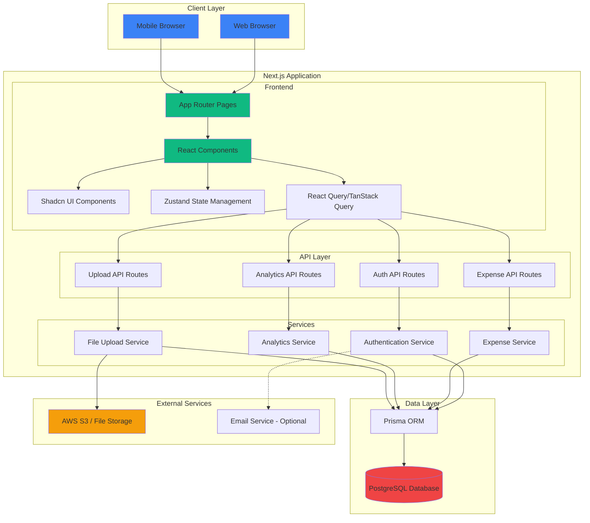
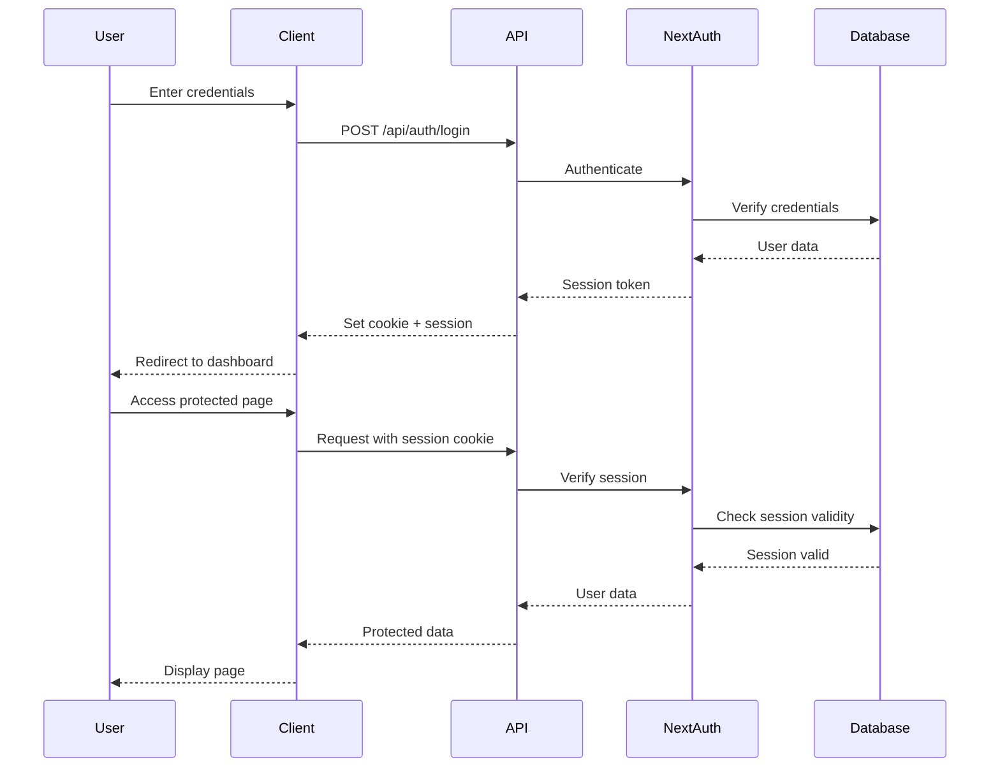
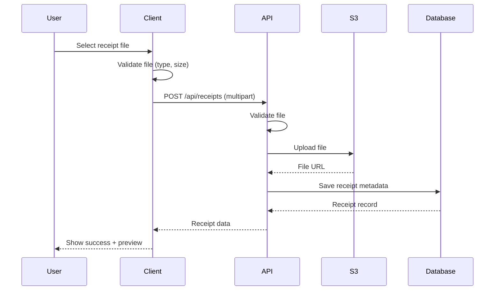

# Application Architecture

## Overview
The AI-Powered Expense Tracker is built as a modern, full-stack web application using Next.js 14 with the App Router, PostgreSQL database, and a comprehensive technology stack optimized for performance, developer experience, and scalability.

---

## System Architecture Diagram



---

## Technology Stack

### Frontend
- **Framework:** Next.js 14 (App Router)
- **Language:** TypeScript 5.x
- **UI Library:** React 18
- **Component Library:** Shadcn UI (Radix UI primitives)
- **Styling:** TailwindCSS 3.x
- **Icons:** Lucide React
- **Forms:** React Hook Form + Zod validation
- **Charts:** Recharts / Chart.js
- **Date Handling:** date-fns

### State Management & Data Fetching
- **Global State:** Zustand
- **Server State:** TanStack Query (React Query)
- **Form State:** React Hook Form

### Backend
- **API Routes:** Next.js API Routes (App Router)
- **Authentication:** NextAuth.js v5 (Auth.js)
- **File Upload:** Multipart form handling
- **Validation:** Zod schemas

### Database & ORM
- **Database:** PostgreSQL 15+
- **ORM:** Prisma 5.x
- **Migration:** Prisma Migrate
- **Studio:** Prisma Studio (development)

### File Storage
- **Cloud:** AWS S3 (production)
- **Local:** Public folder / MinIO (development)

### Development Tools
- **Package Manager:** npm / pnpm
- **Linting:** ESLint
- **Formatting:** Prettier
- **Type Checking:** TypeScript
- **Git Hooks:** Husky + lint-staged

### Deployment & DevOps
- **Hosting:** Vercel (recommended) / Docker
- **Database Hosting:** Vercel Postgres / Supabase / Railway
- **Containerization:** Docker & Docker Compose
- **CI/CD:** GitHub Actions / Vercel CI

---

## Architecture Layers

### 1. Presentation Layer (Client)

#### Responsibilities
- Render UI components
- Handle user interactions
- Manage client-side state
- Form validation and submission
- Data visualization

#### Key Components
```
app/
├── (auth)/
│   ├── login/page.tsx
│   ├── signup/page.tsx
│   └── layout.tsx
├── (dashboard)/
│   ├── dashboard/page.tsx
│   ├── expenses/page.tsx
│   ├── analytics/page.tsx
│   └── layout.tsx
└── layout.tsx (root)

components/
├── ui/ (Shadcn components)
├── expenses/
│   ├── ExpenseForm.tsx
│   ├── ExpenseList.tsx
│   └── ExpenseCard.tsx
├── charts/
│   ├── TrendsChart.tsx
│   └── CategoryChart.tsx
└── layouts/
    ├── Header.tsx
    └── Sidebar.tsx
```

#### State Management Strategy

**Zustand (Client State)**
```typescript
// stores/userStore.ts
interface UserState {
  user: User | null;
  setUser: (user: User) => void;
  clearUser: () => void;
}

// stores/uiStore.ts
interface UIState {
  sidebarOpen: boolean;
  toggleSidebar: () => void;
}
```

**React Query (Server State)**
```typescript
// hooks/useExpenses.ts
export const useExpenses = (filters?: ExpenseFilters) => {
  return useQuery({
    queryKey: ['expenses', filters],
    queryFn: () => fetchExpenses(filters),
  });
};

// hooks/useExpenseMutations.ts
export const useCreateExpense = () => {
  const queryClient = useQueryClient();
  return useMutation({
    mutationFn: createExpense,
    onSuccess: () => {
      queryClient.invalidateQueries({ queryKey: ['expenses'] });
    },
  });
};
```

---

### 2. API Layer (Next.js API Routes)

#### Responsibilities
- Handle HTTP requests
- Request validation
- Authentication/authorization
- Business logic delegation
- Response formatting
- Error handling

#### Route Structure
```
app/api/
├── auth/
│   ├── signup/route.ts
│   ├── login/route.ts
│   ├── logout/route.ts
│   └── [...nextauth]/route.ts
├── user/
│   ├── profile/route.ts
│   └── password/route.ts
├── expenses/
│   ├── route.ts (GET, POST)
│   └── [id]/route.ts (GET, PUT, DELETE)
├── categories/
│   └── route.ts (GET)
├── receipts/
│   ├── route.ts (POST)
│   └── [id]/route.ts (DELETE)
└── analytics/
    ├── trends/route.ts
    └── categories/route.ts
```

#### API Route Example
```typescript
// app/api/expenses/route.ts
import { NextRequest, NextResponse } from 'next/server';
import { getServerSession } from 'next-auth';
import { z } from 'zod';
import { prisma } from '@/lib/prisma';
import { authOptions } from '@/lib/auth';

const expenseSchema = z.object({
  amount: z.number().positive(),
  categoryId: z.string().uuid(),
  expenseDate: z.string().date(),
  description: z.string().max(500).optional(),
});

export async function GET(request: NextRequest) {
  const session = await getServerSession(authOptions);
  if (!session) {
    return NextResponse.json({ error: 'Unauthorized' }, { status: 401 });
  }

  const { searchParams } = new URL(request.url);
  const startDate = searchParams.get('startDate');
  const endDate = searchParams.get('endDate');

  const expenses = await prisma.expense.findMany({
    where: {
      userId: session.user.id,
      ...(startDate && endDate && {
        expenseDate: {
          gte: new Date(startDate),
          lte: new Date(endDate),
        },
      }),
    },
    include: {
      category: true,
      receipts: true,
    },
    orderBy: {
      expenseDate: 'desc',
    },
  });

  return NextResponse.json(expenses);
}

export async function POST(request: NextRequest) {
  const session = await getServerSession(authOptions);
  if (!session) {
    return NextResponse.json({ error: 'Unauthorized' }, { status: 401 });
  }

  try {
    const body = await request.json();
    const validatedData = expenseSchema.parse(body);

    const expense = await prisma.expense.create({
      data: {
        ...validatedData,
        userId: session.user.id,
      },
      include: {
        category: true,
      },
    });

    return NextResponse.json(expense, { status: 201 });
  } catch (error) {
    if (error instanceof z.ZodError) {
      return NextResponse.json(
        { error: 'Validation failed', details: error.errors },
        { status: 400 }
      );
    }
    return NextResponse.json(
      { error: 'Internal server error' },
      { status: 500 }
    );
  }
}
```

---

### 3. Service Layer

#### Responsibilities
- Business logic implementation
- Data transformation
- Complex queries
- Transaction management
- External service integration

#### Service Structure
```
lib/services/
├── authService.ts
├── expenseService.ts
├── uploadService.ts
└── analyticsService.ts
```

#### Service Example
```typescript
// lib/services/expenseService.ts
import { prisma } from '@/lib/prisma';
import { Prisma } from '@prisma/client';

export class ExpenseService {
  static async getUserExpenses(
    userId: string,
    filters?: {
      startDate?: Date;
      endDate?: Date;
      categoryId?: string;
    }
  ) {
    return await prisma.expense.findMany({
      where: {
        userId,
        ...(filters?.startDate && filters?.endDate && {
          expenseDate: {
            gte: filters.startDate,
            lte: filters.endDate,
          },
        }),
        ...(filters?.categoryId && { categoryId: filters.categoryId }),
      },
      include: {
        category: true,
        receipts: true,
      },
      orderBy: {
        expenseDate: 'desc',
      },
    });
  }

  static async createExpense(data: {
    userId: string;
    amount: number;
    categoryId: string;
    expenseDate: Date;
    description?: string;
  }) {
    return await prisma.expense.create({
      data,
      include: {
        category: true,
      },
    });
  }

  static async updateExpense(
    id: string,
    userId: string,
    data: Partial<{
      amount: number;
      categoryId: string;
      expenseDate: Date;
      description: string;
    }>
  ) {
    // Verify ownership
    const expense = await prisma.expense.findFirst({
      where: { id, userId },
    });

    if (!expense) {
      throw new Error('Expense not found or unauthorized');
    }

    return await prisma.expense.update({
      where: { id },
      data,
      include: {
        category: true,
      },
    });
  }

  static async deleteExpense(id: string, userId: string) {
    // Verify ownership
    const expense = await prisma.expense.findFirst({
      where: { id, userId },
    });

    if (!expense) {
      throw new Error('Expense not found or unauthorized');
    }

    // This will cascade delete receipts
    return await prisma.expense.delete({
      where: { id },
    });
  }
}
```

---

### 4. Data Access Layer (Prisma ORM)

#### Responsibilities
- Database connection management
- Query execution
- Schema migrations
- Type-safe database access

#### Prisma Client Setup
```typescript
// lib/prisma.ts
import { PrismaClient } from '@prisma/client';

const globalForPrisma = globalThis as unknown as {
  prisma: PrismaClient | undefined;
};

export const prisma =
  globalForPrisma.prisma ??
  new PrismaClient({
    log: process.env.NODE_ENV === 'development' ? ['query', 'error', 'warn'] : ['error'],
  });

if (process.env.NODE_ENV !== 'production') {
  globalForPrisma.prisma = prisma;
}
```

---

## Authentication Flow



### NextAuth.js Configuration
```typescript
// lib/auth.ts
import { NextAuthOptions } from 'next-auth';
import CredentialsProvider from 'next-auth/providers/credentials';
import { compare } from 'bcryptjs';
import { prisma } from '@/lib/prisma';

export const authOptions: NextAuthOptions = {
  providers: [
    CredentialsProvider({
      name: 'Credentials',
      credentials: {
        email: { label: 'Email', type: 'email' },
        password: { label: 'Password', type: 'password' },
      },
      async authorize(credentials) {
        if (!credentials?.email || !credentials?.password) {
          throw new Error('Email and password required');
        }

        const user = await prisma.user.findUnique({
          where: { email: credentials.email },
        });

        if (!user || !user.passwordHash) {
          throw new Error('Invalid credentials');
        }

        const isPasswordValid = await compare(
          credentials.password,
          user.passwordHash
        );

        if (!isPasswordValid) {
          throw new Error('Invalid credentials');
        }

        // Update last login
        await prisma.user.update({
          where: { id: user.id },
          data: { lastLogin: new Date() },
        });

        return {
          id: user.id,
          email: user.email,
          name: user.name,
          image: user.profilePictureUrl,
        };
      },
    }),
  ],
  session: {
    strategy: 'jwt',
  },
  pages: {
    signIn: '/login',
    signOut: '/login',
  },
  callbacks: {
    async jwt({ token, user }) {
      if (user) {
        token.id = user.id;
      }
      return token;
    },
    async session({ session, token }) {
      if (session.user) {
        session.user.id = token.id as string;
      }
      return session;
    },
  },
};
```

---

## File Upload Architecture

### Upload Flow


### Upload Service
```typescript
// lib/services/uploadService.ts
import { S3Client, PutObjectCommand } from '@aws-sdk/client-s3';
import { v4 as uuidv4 } from 'uuid';

const s3Client = new S3Client({
  region: process.env.AWS_REGION!,
  credentials: {
    accessKeyId: process.env.AWS_ACCESS_KEY_ID!,
    secretAccessKey: process.env.AWS_SECRET_ACCESS_KEY!,
  },
});

export class UploadService {
  static async uploadReceipt(
    file: File,
    expenseId: string
  ): Promise<{ url: string; key: string }> {
    const fileExtension = file.name.split('.').pop();
    const fileName = `receipts/${expenseId}/${uuidv4()}.${fileExtension}`;

    const buffer = Buffer.from(await file.arrayBuffer());

    await s3Client.send(
      new PutObjectCommand({
        Bucket: process.env.S3_BUCKET_NAME!,
        Key: fileName,
        Body: buffer,
        ContentType: file.type,
      })
    );

    const url = `https://${process.env.S3_BUCKET_NAME}.s3.${process.env.AWS_REGION}.amazonaws.com/${fileName}`;

    return { url, key: fileName };
  }

  static async deleteReceipt(key: string): Promise<void> {
    // Implementation for S3 delete
  }
}
```

---

## Error Handling Strategy

### Client-Side
```typescript
// lib/errorHandler.ts
import { toast } from 'sonner';

export const handleApiError = (error: unknown) => {
  if (error instanceof Response) {
    if (error.status === 401) {
      toast.error('Please log in to continue');
      window.location.href = '/login';
    } else if (error.status === 403) {
      toast.error('You do not have permission to perform this action');
    } else if (error.status >= 500) {
      toast.error('Server error. Please try again later.');
    } else {
      toast.error('An error occurred');
    }
  } else {
    toast.error('Network error. Please check your connection.');
  }
};
```

### API Error Response Format
```typescript
// lib/apiResponse.ts
export interface ApiError {
  error: string;
  details?: unknown;
  statusCode: number;
}

export interface ApiSuccess<T> {
  data: T;
  message?: string;
}
```

---

## Performance Optimization

### Caching Strategy
- **React Query:** Stale-while-revalidate for server state
- **Next.js:** Static generation for public pages
- **Database:** Index optimization for frequent queries
- **CDN:** Static assets and images via Vercel CDN

### Code Splitting
- Route-based code splitting (Next.js automatic)
- Dynamic imports for heavy components
- Lazy loading for charts and visualizations

### Database Optimization
- Connection pooling via Prisma
- Indexed queries for common patterns
- Pagination for large datasets
- Aggregate queries for analytics

---

## Security Considerations

### Authentication & Authorization
- JWT-based session management via NextAuth.js
- HTTP-only cookies for session storage
- CSRF protection built into Next.js
- Role-based access control (future enhancement)

### Data Validation
- Client-side: React Hook Form + Zod
- Server-side: Zod schema validation
- Database: Constraints and triggers

### File Upload Security
- File type validation (whitelist)
- File size limits
- Virus scanning (production recommendation)
- Signed URLs for S3 access

### API Security
- Rate limiting (middleware)
- Input sanitization
- SQL injection prevention (Prisma ORM)
- XSS protection (React auto-escaping)

---

## Deployment Architecture

### Development
```
Local Machine
├── Next.js Dev Server (port 3000)
├── PostgreSQL (Docker, port 5432)
└── MinIO/Local Storage
```

### Production (Vercel)
```
Vercel
├── Next.js Application (Serverless)
├── Edge Functions
└── CDN

External Services
├── Vercel Postgres / Supabase
├── AWS S3
└── Monitoring (Vercel Analytics)
```

### Docker Deployment
```
Docker Compose
├── Next.js Container (port 3000)
├── PostgreSQL Container (port 5432)
├── Nginx Reverse Proxy (port 80/443)
└── Shared volumes for uploads
```

---

## Monitoring & Logging

### Application Monitoring
- Vercel Analytics (Web Vitals)
- Error tracking: Sentry (optional)
- Logging: Winston / Pino

### Database Monitoring
- Prisma logging in development
- PostgreSQL query performance monitoring
- Connection pool metrics

### Performance Metrics
- Core Web Vitals (LCP, FID, CLS)
- API response times
- Database query performance
- File upload success rates

---

## Future Enhancements

### Scalability
- Microservices architecture (if needed)
- Message queue for async operations (BullMQ)
- Redis caching layer
- Database read replicas

### Features
- Real-time notifications (WebSockets)
- Multi-currency support
- Recurring expenses
- Budget tracking
- Export to PDF/Excel
- Mobile app (React Native)

### AI Integration (POC Enhancement)
- OCR receipt parsing
- Auto-categorization ML model
- Spending insights generation
- Anomaly detection

