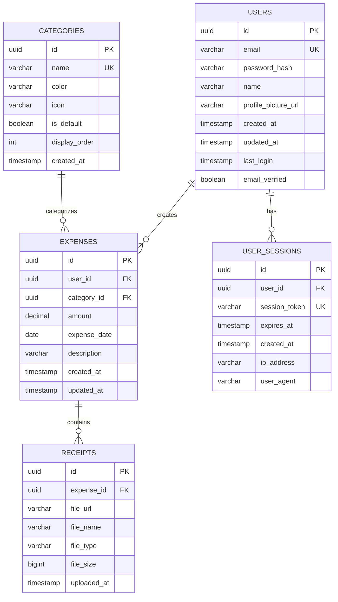

# Database Entity Relationship Diagram (ERD)

## Overview
This ERD represents the complete database structure for the AI-Powered Expense Tracker application. The design supports all user stories including user management, expense tracking, categorization, receipt uploads, and data visualization.

## ERD Diagram

## Entity Relationships

### 1. USERS ↔ EXPENSES
- **Type:** One-to-Many
- **Relationship:** One user can create multiple expenses
- **Foreign Key:** `expenses.user_id` references `users.id`
- **Cascade:** ON DELETE CASCADE (when user is deleted, all their expenses are deleted)

### 2. USERS ↔ USER_SESSIONS
- **Type:** One-to-Many
- **Relationship:** One user can have multiple active sessions
- **Foreign Key:** `user_sessions.user_id` references `users.id`
- **Cascade:** ON DELETE CASCADE (when user is deleted, all sessions are deleted)

### 3. CATEGORIES ↔ EXPENSES
- **Type:** One-to-Many
- **Relationship:** One category can be assigned to multiple expenses
- **Foreign Key:** `expenses.category_id` references `categories.id`
- **Cascade:** ON DELETE RESTRICT (prevent category deletion if expenses exist)

### 4. EXPENSES ↔ RECEIPTS
- **Type:** One-to-Many
- **Relationship:** One expense can have multiple receipts attached
- **Foreign Key:** `receipts.expense_id` references `expenses.id`
- **Cascade:** ON DELETE CASCADE (when expense is deleted, receipts are deleted)

## Key Design Decisions

### UUID vs Auto-increment IDs
- **Choice:** UUID (Universally Unique Identifier)
- **Reasoning:** 
  - Better for distributed systems
  - No sequential ID guessing for security
  - Easier to merge data across environments
  - Suitable for Next.js API routes

### Soft Delete vs Hard Delete
- **Choice:** Hard delete with CASCADE rules
- **Reasoning:**
  - POC scope doesn't require audit trail
  - Simpler implementation
  - Can be enhanced later with `deleted_at` column if needed

### Separate Receipts Table
- **Choice:** Separate table instead of array column
- **Reasoning:**
  - Supports multiple receipts per expense
  - Better for file metadata management
  - Easier to query and manage storage
  - PostgreSQL relational best practice

### Session Management
- **Choice:** Database-backed sessions
- **Reasoning:**
  - NextAuth.js compatibility
  - Better control over active sessions
  - Support for "logout from all devices"
  - Session analytics capability

## Indexes Strategy

Indexes are defined in `database-schema.md` but key indexing decisions:

1. **Primary Keys:** All tables use UUID primary keys (automatically indexed)
2. **Foreign Keys:** All foreign key columns are indexed for join performance
3. **Unique Constraints:** Email, session tokens (automatically indexed)
4. **Composite Indexes:** User + Date for expense queries
5. **Partial Indexes:** Active sessions only

## Data Integrity

### Constraints
- NOT NULL on critical fields (email, password_hash, amount, etc.)
- UNIQUE constraints on email and session tokens
- CHECK constraints on amount (must be positive)
- Foreign key constraints with appropriate cascade rules

### Validation
- Application-level validation in Next.js API routes
- Database-level constraints as final safeguard
- Type safety with Prisma TypeScript integration

## Scalability Considerations

### For Future Enhancements
1. **Partitioning:** Expenses table can be partitioned by date for large datasets
2. **Archiving:** Old expenses can be moved to archive tables
3. **Read Replicas:** PostgreSQL replication for analytics queries
4. **Caching:** Redis layer for frequently accessed data (categories, user sessions)

### Migration Path
- Prisma migrations for version control
- Database schema changes tracked in Git
- Rollback capability for failed migrations

## Notes

- All timestamps use UTC timezone
- Decimal type for amounts ensures precision (no floating-point errors)
- File URLs in receipts table can point to S3, local storage, or CDN
- Color codes in categories use hex format (#RRGGBB)
- Icons in categories reference icon library names (e.g., Lucide React icons)

